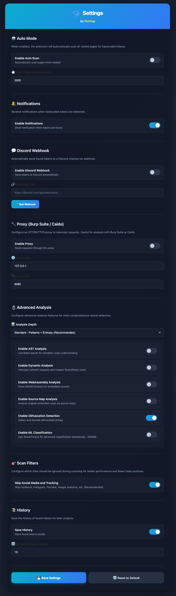

# BlueHawk API Key Finder

A Chrome extension built for **bug bounty hunters**, **red teamers**, and **security researchers**. Automatically scans JavaScript files for hardcoded API keys, secrets, and credentials. Validates if tokens are active and detects cloud bucket takeover opportunities.

**Use cases:**
- Bug bounty reconnaissance - find exposed secrets in web applications
- Red team engagements - identify credential leaks during assessments
- Security audits - scan client-side code for sensitive data exposure

## Features

- **Auto-scan**: Scans pages automatically while browsing (configurable delay)
- **Manual scan**: On-demand scan of current page
- **Deep scan**: Crawls same-domain pages (configurable depth), extracts scripts, fetches source maps
- **Token validation**: Tests tokens against live APIs to confirm if active
- **Bucket takeover detection**: Identifies misconfigured S3/GCS/Azure buckets
- **Discord webhooks**: Real-time alerts when secrets are found
- **History & export**: JSON export for pentest tools, Nuclei template generation

## Screenshots

**Manual Scan**


**Auto-scan Mode**


**Settings**



## Detected Secret Types

| Category | Types |
|----------|-------|
| **Cloud** | AWS (Access Keys, Secret Keys, Session Tokens, MWS), GCP, Azure, Alibaba, DigitalOcean |
| **DevOps** | GitHub (PAT, OAuth, Fine-grained), GitLab, npm, PyPI, Docker Hub, Heroku, Vercel |
| **Payment** | Stripe (live/test), Square, PayPal/Braintree |
| **Communication** | Slack (Bot, User, App tokens + webhooks), Twilio, Telegram, Discord (bot tokens + webhooks) |
| **Email** | SendGrid, Mailgun, MailChimp, Sendinblue |
| **SaaS** | Shopify, HubSpot, Postman, Atlassian, Cloudflare |
| **Monitoring** | New Relic, Datadog |
| **BaaS** | Firebase, Supabase (anon + service role keys) |
| **Databases** | MongoDB, PostgreSQL, MySQL, Redis connection strings |
| **Generic** | JWT, Bearer tokens, API keys, secrets, passwords, private keys (RSA, OpenSSH, PGP) |

## Bucket Takeover Detection

Scans for misconfigured or unclaimed buckets:
- AWS S3
- Google Cloud Storage
- Azure Blob Storage
- DigitalOcean Spaces
- Vercel Blob
- Firebase Storage
- Supabase Storage
- CloudFront distributions
- Netlify/GitHub Pages

## Token Validation

Validates tokens against live APIs (with rate limiting):
- GitHub/GitLab: User info lookup
- Firebase/Google: API key validation
- Vercel: User/teams/projects access
- Supabase: JWT decode + API test
- Slack: auth.test endpoint
- Stripe: Customer list access
- JWT: Expiration check

## Installation

```bash
git clone https://github.com/fbettag/bluehawk-api-key-finder
cd bluehawk-api-key-finder
npm install
npm run build
```

1. Open `chrome://extensions/`
2. Enable "Developer mode"
3. Click "Load unpacked"
4. Select the project folder

## Usage

### Scan Modes

| Mode | Trigger | Scope |
|------|---------|-------|
| **Auto** | Page load | Current page scripts (same-domain only) |
| **Manual** | Click "Scan Page" | Current page scripts + validation |
| **Deep** | Click "Deep Scan" | Crawls same-domain links, up to 50 pages |

### Settings

- **Auto-scan delay**: Wait time before scanning (default: 5s)
- **Skip social media**: Ignores Facebook, Twitter, Google services, etc.
- **Discord webhook**: URL for real-time alerts
- **Proxy**: Route validation requests through Burp/ZAP (host:port)

### Export Options

- **JSON export**: Tokens grouped by severity (CRITICAL/HIGH/MEDIUM/LOW)
- **Nuclei template**: YAML template for discovered endpoints

## File Structure

```
manifest.json                 # Extension config (Manifest V3)
background.js                 # Service worker - notifications, webhooks, storage
src/
  content/index.js            # Content script - token detection
  popup/                      # Extension popup UI
  settings/                   # Configuration page
  history/                    # Findings history and export
  shared/                     # Patterns, constants, filters
  analysis/                   # AST, entropy, heuristics analyzers
  workers/                    # Web Workers for non-blocking analysis
  injection/                  # Network hooks, React/Redux inspectors
  validator/                  # Token validation against live APIs
  crawler/                    # Multi-page crawler with source map extraction
  detector/                   # S3/GCS/Azure bucket takeover detection
icons/                        # Extension icons (16, 48, 128px)
dist/                         # Built extension (load this in Chrome)
```

## Technical Details

- **Non-blocking**: Uses Web Workers and `requestIdleCallback` for heavy analysis
- **Caching**: Script hash cache (1h TTL) prevents rescanning
- **Rate limiting**: Token validation limited to 3/batch with delays
- **False positive filtering**: Skips feature flags, placeholders, common words
- **Domain filtering**: Ignores CDNs, analytics, and tracking scripts

## Domain Blocklist

Auto-scan skips these domains to reduce noise:
- Social: Facebook, Instagram, Twitter/X, YouTube, LinkedIn, TikTok, Reddit, Pinterest
- Google: Analytics, Tag Manager, Ads (but not googleapis.com storage)
- Microsoft: Office, Outlook, Bing
- Analytics: Hotjar, Segment, Mixpanel, Amplitude, FullStory
- CDNs: Cloudflare, Akamai, Fastly, jsDelivr, unpkg

## Severity Levels

| Severity | Token Types |
|----------|-------------|
| **CRITICAL** | AWS, GitHub, Stripe, Private Keys, Passwords, MongoDB, PostgreSQL, MySQL, Alibaba, PayPal, npm, PyPI, Docker, Shopify |
| **HIGH** | Supabase, Firebase, Vercel, SendGrid, Twilio, Slack, GitLab, Discord, Telegram, Mailgun, HubSpot, New Relic, Datadog, DigitalOcean |
| **MEDIUM** | JWT, API_KEY, TOKEN, Bearer, Twitter, Facebook, Google, Instagram, Heroku, Azure, Cloudflare |
| **LOW** | Redis |

## License

MIT

## Author

[fbettag](https://github.com/fbettag)
