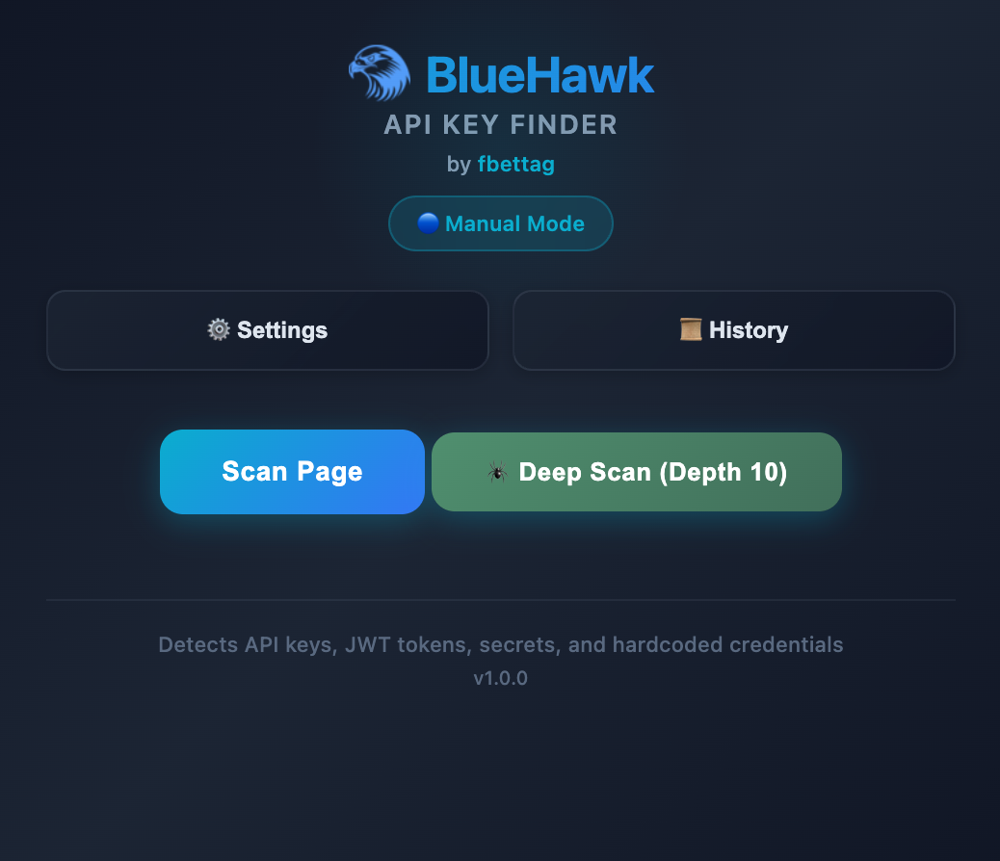
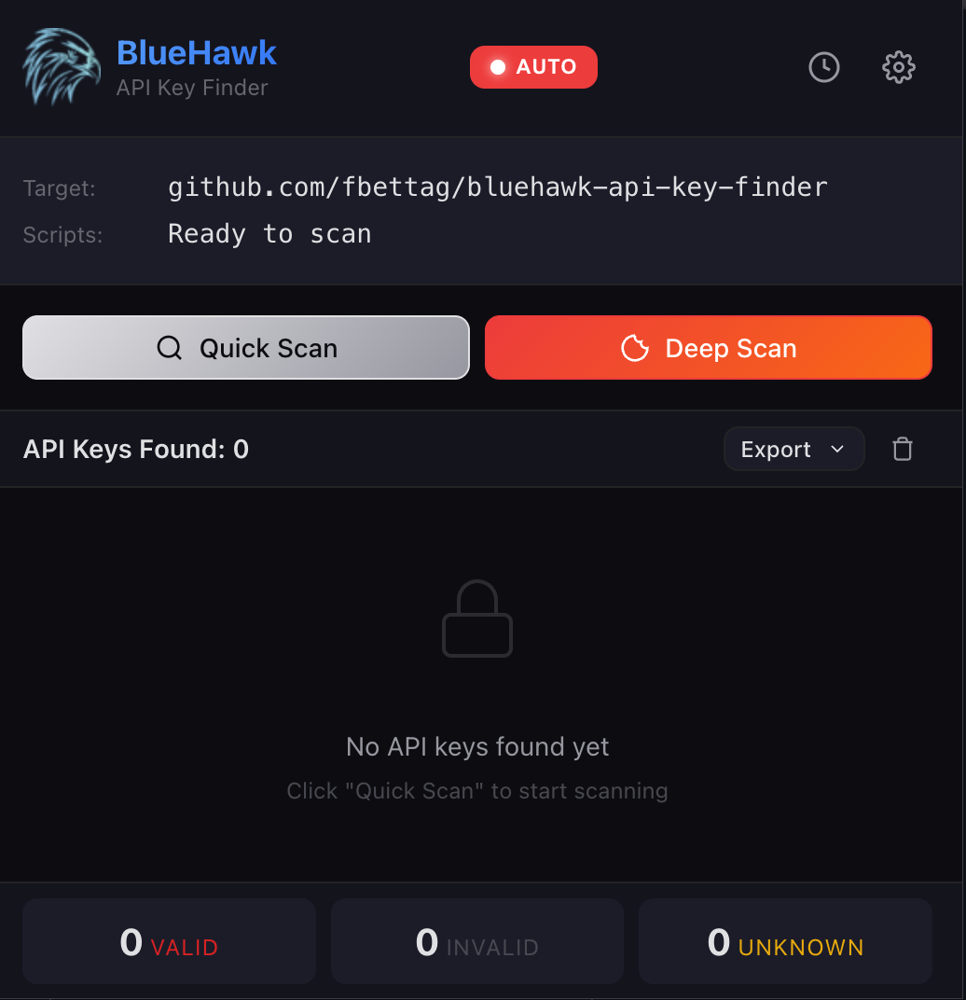

# BlueHawk API Key Finder

> An advanced API key and secrets detection tool for Chrome.

[](https://opensource.org/licenses/MIT)
[](https://developer.chrome.com/docs/extensions/)
[](https://developer.chrome.com/docs/extensions/mv3/intro/)

## Overview

BlueHawk is a security research tool for bug bounty hunters, red teamers, and security researchers. It automatically scans JavaScript files for hardcoded API keys, secrets, and credentials, validates if tokens are active, and detects cloud bucket takeover opportunities.

> **IMPORTANT**: This tool is intended for **authorized security testing only**. Users must obtain proper authorization before testing any systems they do not own or have explicit permission to test.

## Screenshots

<table>
  <tr>
    <td align="center"><b>Manual Scan</b></td>
    <td align="center"><b>Auto Scan Mode</b></td>
  </tr>
  <tr>
    <td></td>
    <td></td>
  </tr>
</table>

## Features

### Token Detection
- **Pattern Matching**: 50+ regex patterns for API keys, tokens, and secrets.
- **AST Analysis**: Deep JavaScript parsing for obfuscated credentials.
- **Entropy Scoring**: Identifies high-entropy strings likely to be secrets.
- **Context Extraction**: Shows surrounding code for each finding.

### Token Validation
- **Live API Testing**: Validates tokens against real endpoints.
- **Rate Limiting**: Prevents API abuse during validation.
- **Status Tracking**: Valid, Invalid, or Unknown classification.
- **Supported Services**: GitHub, GitLab, Firebase, Vercel, Supabase, Slack, Stripe.

### Bucket Takeover Detection
- **Cloud Storage**: AWS S3, Google Cloud Storage, Azure Blob.
- **CDN Services**: CloudFront, Vercel, Netlify.
- **BaaS Platforms**: Firebase Storage, Supabase Storage.

### Scan Modes
- **Manual Scan**: On-demand scan of current page scripts.
- **Deep Scan**: Crawls same-domain pages, extracts source maps.
- **Auto Scan**: Background scanning while browsing (configurable).

## Quick Start

### Prerequisites
- Google Chrome (v110+)
- Node.js (v18+) for building

### Installation

#### Method 1: Build from Source (Recommended)
```bash
# Clone the repository
git clone https://github.com/fbettag/bluehawk-api-key-finder.git
cd bluehawk-api-key-finder

# Install dependencies and build
npm install
npm run build
```

#### Method 2: Load in Chrome
1. Open `chrome://extensions/`
2. Enable "Developer mode"
3. Click "Load unpacked"
4. Select the `dist` folder

## Usage Guide

1. **Navigate**: Visit any web application you're authorized to test.
2. **Scan**: Click the BlueHawk icon and select scan type.
3. **Review**: Examine detected tokens with validation status.
4. **Export**: Download findings as JSON or CSV.

### Scan Modes

| Mode | Trigger | Scope |
|------|---------|-------|
| **Manual** | Click "Quick Scan" | Current page scripts |
| **Deep** | Click "Deep Scan" | Crawls same-domain, up to 50 pages |
| **Auto** | Page load | Background scanning (configurable) |

## Technical Specifications

### Detected Secret Types

| Category | Types |
|----------|-------|
| **Cloud** | AWS, GCP, Azure, Alibaba, DigitalOcean |
| **DevOps** | GitHub, GitLab, npm, PyPI, Docker Hub, Heroku, Vercel |
| **Payment** | Stripe, Square, PayPal/Braintree |
| **Communication** | Slack, Twilio, Telegram, Discord |
| **Email** | SendGrid, Mailgun, MailChimp |
| **BaaS** | Firebase, Supabase |
| **Databases** | MongoDB, PostgreSQL, MySQL, Redis |
| **Generic** | JWT, Bearer tokens, API keys, private keys |

### Severity Levels

| Severity | Token Types |
|----------|-------------|
| **CRITICAL** | AWS, GitHub, Stripe, Private Keys, Passwords, Database URIs |
| **HIGH** | Supabase, Firebase, Vercel, SendGrid, Twilio, Slack |
| **MEDIUM** | JWT, API_KEY, Bearer, Google, Azure |
| **LOW** | Redis, generic tokens |

### File Structure
```
dist/                   # Built extension (load this in Chrome)
src/
  popup/                # Extension popup UI
  settings/             # Configuration page
  history/              # Findings history and export
  content/              # Content script - token detection
  background/           # Service worker
  shared/               # Patterns, constants, filters
  workers/              # Web Workers for analysis
icons/                  # Extension icons
```

## Support

- **Issues**: [GitHub Issues](https://github.com/fbettag/bluehawk-api-key-finder/issues) for bug reports.
- **Discussions**: [GitHub Discussions](https://github.com/fbettag/bluehawk-api-key-finder/discussions) for questions.

## License

This project is licensed under the **MIT License**.
